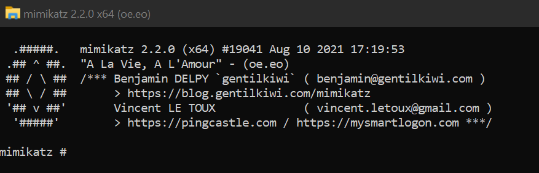

# Backpack


Backpack is a packer that use process hollowing to hide your payload writen in Golang. This is based on the repo of abdullah2993 (https://github.com/abdullah2993/go-runpe) for the hollowing part. 


## Usage
### Cypher your PE with AES :
```powershell
cd PEtoAES
PEtoAES> go run pe2AES.go -p "path to the PE to pack" -k "32 char key"
[+] Done !
```
It should create two file, key.txt and pe.txt
### Compile the packer with your AES file :
```powershell
go build main.go
```
Then, just execute your PE and enjoy.



## Contributing
Pull requests are welcome.